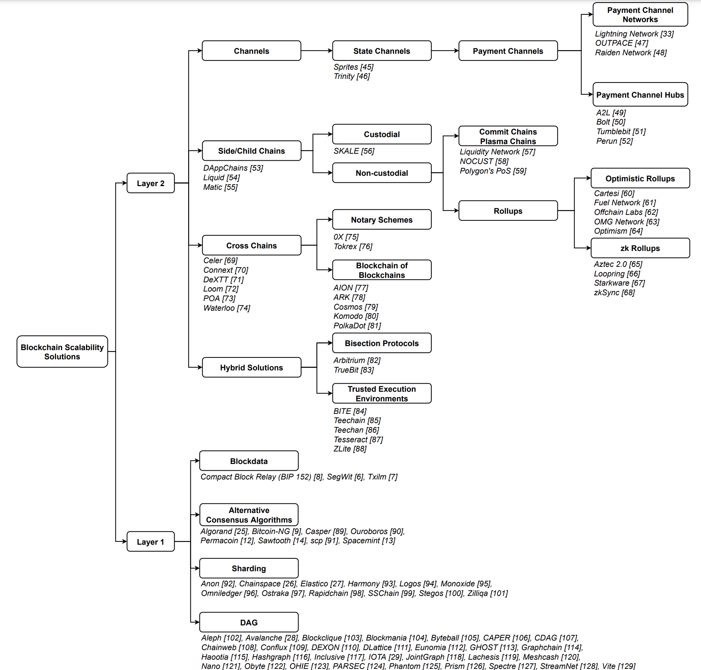
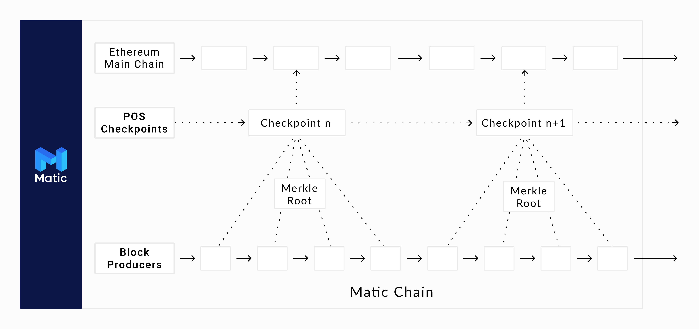

Recently I came across an awesome paper for survey of Layer-Two blockchain protocols. You can find it here: https://arxiv.org/pdf/2204.08032. Inspired from the paper, I wanted to jot down a few of my notes, especially for people who do not have enough time to parse through the entire paper and may want to get the jist of things quite quickly.

The most interesting thing I found about the paper was this specific image:

While this may not be the most accurate overview out there, it gets you close enough!

<!--  -->
## What's up with blockchains, why are their L2s
Blockchains have often been attributed to as being affected by the "blockchain trilemma", which goes somewhat on the same lines as the "CAP theorem": You can't have all three attributes.

> **The Blockchain Trilemma**: Decentralization, Security, Scalability, you can't really have all three

goes kinda well with

> **CAP Theorem**: Consistency, Availability and Partition-Tolerance, you can't really have all three

Anyways, blockchains often keep Security as a paramount trait that they cannot compromize on. Hence, the decision is to be taken between decentralization and scalability. This can be visualized as a comparison between a small data center vs many different computers scattered over the world connected via internet. While the server in a data center are all fast, close together, hence can communicate more efficiently, in turn churn out more scalability / throughput-per-second. But this can often be taken down by a single govenment entity since it is all collocated. On the other hand, you may not have control over the quality, make and processing capabilities of computers spread around the world. Plus, the communication takes more time (the data packets now have to travel the entire world). However, this setup cannot easily be taken down by single government entities for example due to varied jurisdiction. This is the decentralization end of things.

More often than not, layer-1 blockchains choose security and decentralization and try their level best to scale while not compromising too much on their primary two traits.

- Decentralization | Security | Scalability Trilemma

- Mode
- Incentive Mechanisms
- OP Stack
- Synthetix
- dY/dX
- BNB chain
- Polygon

- Plasma
- based rollup
- Validium
- Rollup
- Plasma
- Sidechains
- Channels

- Danksharding and EIP-4844
- Liquidity Fragmentations

- Hermez: Massive Migrations
- Forced exits and Inclusion Lists
- Optimistic Rollup vs zk Rollups

zkRollups can't use smart contracts?

Sidechain: xDai / Polygon

Plasma chains: differentiate on the amount of security required

Bitcoin: 7 tx / second
Payment Channels: Lightning Network (can only be used for transactions, not smart contract)
