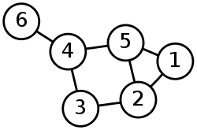

Interviews are hard, and quirks for rust do make them harder. Especially when it comes to data structures like graphs and trees. While in other languages you can quickly code up a pointer based solution due to those languages not having a borrow checker. However, the borrow checker is a bane for writing these data structures in rust, especially in a time constrained setting such as that of a coding interview. This post intends to make that a little easier!

## A shared reference with interior mutability: `NodeRef`
If you have struggled with rust's borrow checker enough, you know it's hard for rust to be conviced of the following situation:

> I have two entities (vertices) $A$ and $B$ which both want to point to (hence, hold a shared reference to) a third entity $C$. $A$, $B$ and $C$ live as long as each other. And maybe sometimes $C$ wants to be mutated as well.

If you know rust, you know this is stupidly hard with bare references. Not just that you start dealing with lifetimes due to "$A$, $B$, $C$ live as long as each other", but mutation when shared references are held is a problem on top (which sometimes we do want to have access to).

### What is a `NodeRef`
A `NodeRef` is simply a type alias to the following:
```rust
type NodeRef = std::Rc<std::cell::RefCell<Node>>
```
where `Node` is some struct which holds the information relevant to a specific vertex in a graph or a tree.

To understand what we are trying to do here, try refering to these documentations:
- https://doc.rust-lang.org/std/rc/
- https://doc.rust-lang.org/std/cell/index.html#refcellt

`std::Rc` is a reference-counting single-threaded immutable smart pointer which holds the value it has internally till the last reference to that data goes out of scope. What's important is to understand it is single-threaded which is not a problem for most of the applications under the pretext of interviews, where we have to code fast.

`std::cell::RefCell` is needed because we need **interior-mutability**: the ability to modify `Node` even when we do not have the sole mutable access of the underlying at the compile time. Do note that `RefCell` does not allow you to break the borrow-checking rules, it just defers that to the runtime where we can do `.borrow()` or `.borrow_mut()` and ask for the relevant style of references.

## Example implementation: Graph Breadth-First-Search
Let's try implementing Graph Breadth First Search on this seemingly innocent undirected graph:



We will use this simple test:
```rust
#[test]
fn basic_graph_bfs() {
    // Create a new `Graph` object, needed to ensure every node
    // has a unique id that doesn't clash with other nodes
    let mut graph = Graph::new();
    const NODE_COUNT: usize = 6;

    // Create all nodes
    let nodes = (1..(NODE_COUNT+1))
                .map(|vertex_id| graph.new_node(vertex_id))
                .collect::<Vec<NodeRef>>();
    
    // Connect them
    let connections = vec![
        (1usize, vec![2usize, 5]),
        (2, vec![5, 3]),
        (3, vec![2, 4]),
        (4, vec![3, 5, 6]),
        (5, vec![1, 4]),
        (6, vec![4]),
    ];

    for (vtx_id, neighbors) in connections {
        for neighbor_id in neighbors {
            nodes[vtx_id - 1].borrow_mut().attach(nodes[neighbor_id - 1].clone());
        }
    }

    assert_eq!(graph.bfs(), vec![1, 2, 5, 3, 4, 6]);
}
```

What we have done above is simple. We create a new "graph" via `Graph::new()`, and create nodes which are all `1`-based indexed. That means, we are not in the realm of `[0, 1, 2, ...]` for vertex / node identifiers. Hence you would see at places `vtx_id - 1` and `neighbor_id - 1`. This is not strictly necessary and it may be preferred to have `0`-based indexing. However, for exposition purposes, we have chosen to be `1`-indexed for now.

let's try setting up the following two structs `Graph` and `Node`:
```rust
use std::{
    cell::RefCell,
    rc::Rc,
};

type NodeRef = Rc<RefCell<Node>>;

/// Graph is a parent struct that ensures each of the `Node` generated
/// is unique in its identifiers. Also holds reference to all the nodes
/// in `nodes`.
#[derive(Default)]
struct Graph {
    nodes: Vec<NodeRef>,
    unique_id_latest: usize,
}

/// Adjecency List description of a `Node`. Each `Node` remembers
/// its neighbors (outwards), i.e. if node `A` has `B` in its `edges`,
/// `A -> B` is a directed edge. Undirected graphs have both the edges
/// in their representation. `A` holds `B` in its edges, and `B` holds
/// `A` in its.
struct Node {
    unique_id: usize,
    value: usize,
    edges: Vec<NodeRef>,
}
```

Simple `impl` blocks that are obvious to them:
```rust
impl Graph {
    /// Creates a new `Graph` with no nodes, `unique_id_latest`
    /// set to `0` initially
    pub fn new() -> Self {
        Self {
            ..Default::default()
        }
    }

    pub fn new_node(&mut self, value: usize) -> NodeRef {
        todo!()
    }

    pub fn bfs(&self) -> Vec<usize> {
        todo!()
    }
}

impl Node {
    pub fn attach(&mut self, other: NodeRef) {
        self.edges.push(other);
    }

    pub fn update(&mut self, value: usize) {
        self.value = value;
    }
}
```

### Why do we need `unique_id` in `Node`?
`RefCell` does not implement the trait `std::hash::Hash`. You can read more about this trait here: https://doc.rust-lang.org/stable/std/hash/trait.Hash.html. The relevance of `Hash` here is in the fact that we need it to have an instance of `HashSet` of `HashMap`. You need these to among other things create a `visited` hashmap - the list of nodes that you have already accessed before. 

**Aside**: In other setting, people also use the "visited array" where each `Node` is supposed to be represented by an index in a bit array which can be queried. The problem with that is if you have create a graph of 1 million nodes, then further delete all but 10 of the nodes (and relevant connections), that deletion does not help you in making the bit array smaller as the size of such bit array would depend on the largest Node Identifier.

But why does `RefCell` not implement `std::hash::Hash`? The simplest reason is if some type `T` implements `std::hash::Hash`, it is often used in instances where the resultant hash value is assumed to be constant over a program's run. For example, if we create `HashSet<T>`, the way we check if `T` exists via `hashset.contains(t:T)` is by hashing `t`. Now assume if between insertion and query, the value held inside `T` changes. That would mess up this `HashSet` system. Hence as a general rule, types that have **interior mutability** do not implement `std::hash::Hash`.

> Quick question to the reader: Can you implement `std::hash::Hash` for `RefCell<T>` yourself (without forking rust-std)?

`unique_id` is the identifier we put within each `Node` so that it is unique w.r.t. all the other node. **For this reason, you cannot construct a `Node` yourself unless you go via `graph.new_node()` which ensures uniqueness of ID**.

### Let's implement the remaining methods

The remaining methods are pretty self-explanatory after we understand the rationale behind our setup. The following is how the rest of `Graph` impl looks:
```rust
impl Graph {
    pub fn new() -> Self {
        Self {
            ..Default::default()
        }
    }

    pub fn new_node(&mut self, value: usize) -> NodeRef {
        let node = Node {
            unique_id: self.unique_id_latest,
            value: value,
            edges: vec![],
        };
        self.unique_id_latest += 1;
        let node_ref = Rc::new(RefCell::new(node));
        self.nodes.push(node_ref.clone());
        node_ref
    }

    pub fn bfs(&self) -> Vec<usize> {
        let mut visited: HashSet<usize> = HashSet::with_capacity(self.nodes.len());
        let mut bfs = Vec::with_capacity(self.nodes.len());
        let mut queue = VecDeque::with_capacity(self.nodes.len());
        if self.nodes.len() < 1 {
            return bfs;
        }
        
        queue.push_back(self.nodes[0].clone());
        visited.insert(self.nodes[0].borrow().unique_id);
        
        while !queue.is_empty() {
            let node = queue.pop_front().unwrap();

            bfs.push(node.borrow().value);

            node.borrow()
                .edges
                .iter()
                .for_each(|val| {
                    let unique_id = val.borrow().unique_id;
                    if !visited.contains(&unique_id) {
                        visited.insert(unique_id);
                        queue.push_back(val.clone());
                    }
                });
        }
        bfs
    }
}
```
